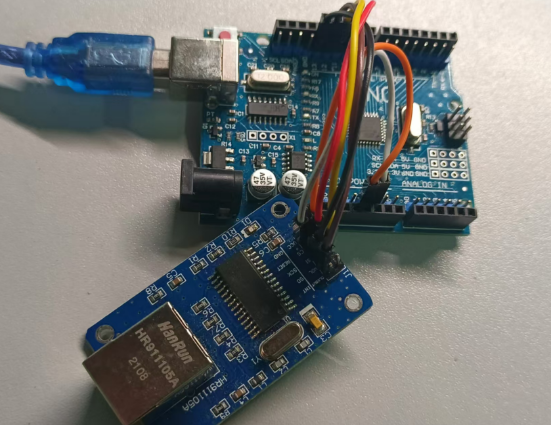

 

# *Heart Broken*

  
  
  
  
  

## Story Background

*January 6, 2025 / 5:04 PM [Overcast / Heavy Rain]:*

[Ding ding ding] A message arrives on the phone...
=======Ethan: John! I'm in trouble! I have something to tell you... Let's meet at our usual spot at 8:00 PM!!!

*January 6, 2025 / 8:04 PM [Overcast / Heavy Rain]:*

[The sound of rustling through the bushes]....

John: It seems I haven't been here for a long time... maybe 10 years?

Ethan: You finally made it... Was the journey smooth?
John: Not too bad..
John: Hey, what happened to your hand???

Ethan: Just my luck, those damn bushes scratched me on the way...
John: That's unfortunate... What did you want to talk about?

Ethan: On February 30, we will be participating in a scientific competition in St. Petersburg, where most investors will be present, so we need to seize this investment opportunity. Unfortunately, the source code for our robot project was sold to the SLEEP team by an insider! I was really confident about winning the grand prize, but now I’m not so sure. You have to find a way to make the SLEEP team pay dearly on the day of the competition! By the way, I'll send you a copy of the source project files to your email...
John: Got it... See you later...

*February 30, 2025 / 3:04 PM [Cloudy] [Finals Venue]:*

The SLEEP team takes the stage...

[Applause...]

[Speech...]

Within five minutes, John exploits a buffer overflow in the SLEEP team's robot.

Suddenly, the robot's display shows "F*** YOU SLEEP B****", and the robot immediately powers off and shuts down...

*February 30, 2025 / 3:30 PM [Cloudy] [Lounge]:*

[Ding ding ding] A voice message arrives on the phone...
=======Ethan: John! You did it! The core of the SLEEP robot crashed, and now their manager is panicking. The results are out, and we got the grand prize, with many investors willing to collaborate with us!
=======John: Ethan! I have to leave now... I saw the SLEEP manager calling the police...

*February 30, 2025 / 8:30 PM [Overcast / Heavy Rain]:*

## Target Machine Deployment

Connect the `ENC28J60` to the `Arduino UNO`, connect it to the computer for programming, and start the robot simulation endpoint.

Connect the RJ45 network interface to the router so that the target machine is in the same local area network. Insert the USB port of the Arduino into the USB port of the target machine.

`$ nmap -p 10032 192.168.0.0/24 --min-rate 1000 -Pn --open`

Alternatively, you can check it in the router's backend.

Navigate to the `./web` directory and use the command:

`$ python3 app.py -iot 192.168.0.111`

(This page provides contestants with links to download binary files, and offers a backup plan to send payloads through a web form to the IoT device.)

`$ sudo python3 robot.py`

If contestants are on an external network, they can directly map port 5000 outward; however, they can only submit buffer overflow payloads through the web page. Conversely, if contestants are on an internal network, they don't need to submit payloads through the web page and can use tools like `nc` or `pwntools` for custom exploit attacks...

Select `Arduino UNO`.

Once the device is connected, the power status will start...

 