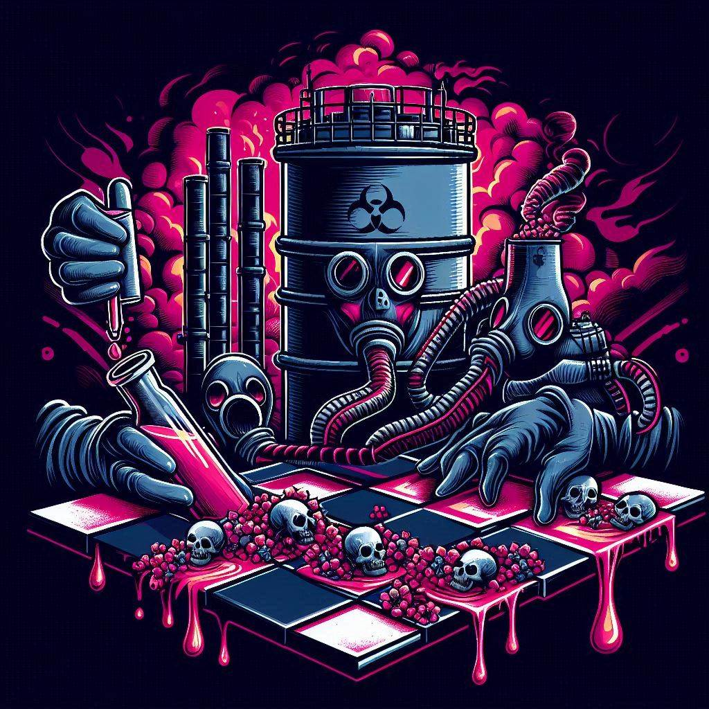
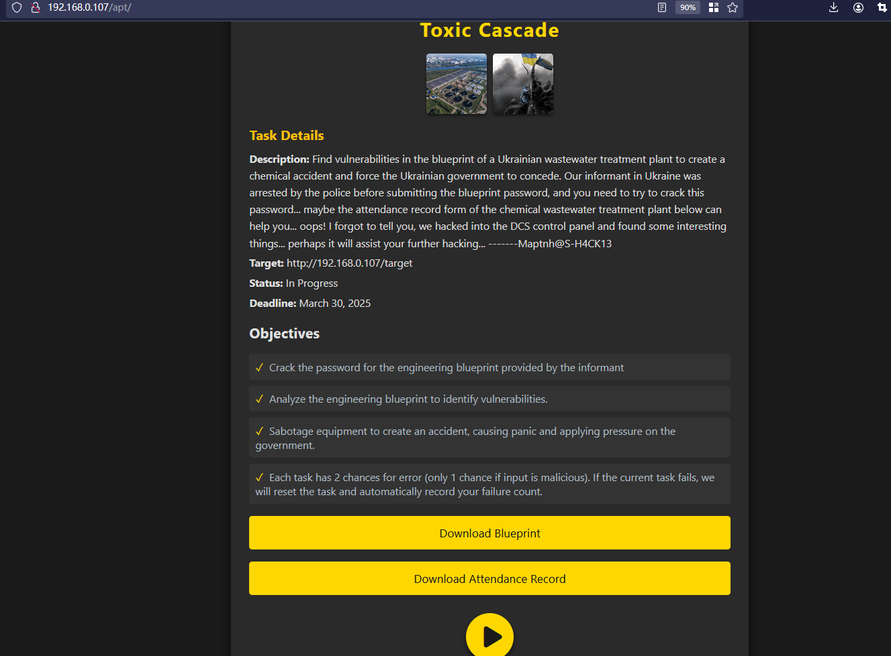
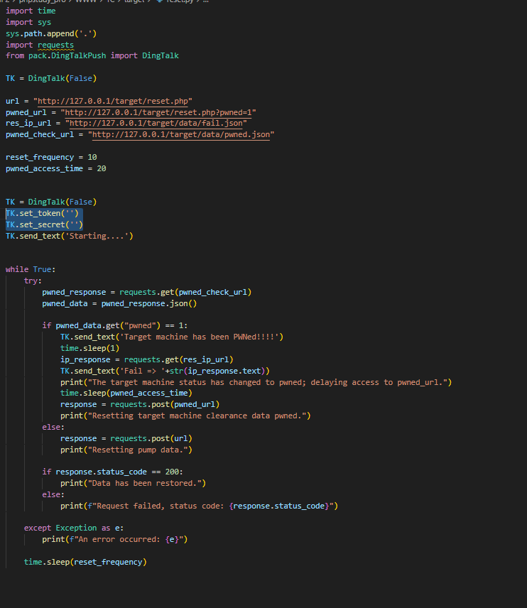
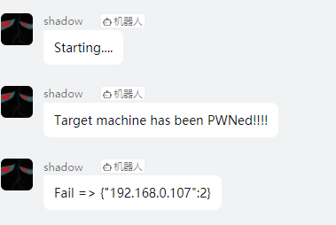

 
# *Toxic Cascade*

 
  
  

  
  
  

  

**Recommended Number of Participants: 1**

## Deployment

Copy `./web/` to the web server.

Access the task panel at `http://<IP>`.

In `./target/reset.py`, set the DingTalk bot TOKEN and signature (used to monitor whether the contestant has pwned this chemical wastewater treatment plant). This script will reset the data in the DCS control panel to avoid data freeze. When the contestant clears the task, a success message will be sent via the DingTalk bot, along with the contestant's failure count.

Run the command:

`$ python reset.py`

 